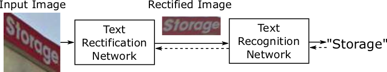

# ASTER: Attentional Scene Text Recognizer with Flexible Rectification

ASTER is an accurate scene text recognizer with flexible rectification mechanism. The research paper can be found [here](https://ieeexplore.ieee.org/abstract/document/8395027/).



The implementation of ASTER reuses code from [Tensorflow Object Detection API](https://github.com/tensorflow/models/tree/master/research/object_detection).

## Prerequisites

ASTER is developed and tested with TensorFlow r1.4. Higher versions are likely to work as well.

Besides, install [Protocol Buffers](https://github.com/google/protobuf) (version>=2.6). In Ubuntu 16.04

```
sudo apt install cmake libcupti-dev
pip3 install --user tensorflow-gpu protobuf tqdm numpy editdistance
```

## Installation
  1. Go to `c_ops/` and run `build.sh` to build the custom operators
  2. Execute `protoc aster/protos/*.proto --python_out=.` to build the protobuf files
  3. Add `/path/to/aster` to `PYTHONPATH`, or set this variable for every run

## Demo

A demo program is located at `aster/demo.py`, accompanied with pretrained model files which can be found at our [release page](https://github.com/bgshih/aster/releases). Download `model-demo.zip` and extract it under `aster/experiments/demo/` before running the demo.

To run the demo, simply execute:

```
python3 aster/demo.py
```

## Training and on-the-fly evaluation
To run the example training, execute

```
python3 aster/train.py \
  --exp_dir experiments/aster \
  --num_clones 2
```

Change the configuration in `experiments/aster/trainval.prototxt` to configure your own training process.

During the training, run a separate program to repeatedly evaluates the produced checkpoints.

```
python3 aster/eval.py \
   --exp_dir experiments/aster
```

Evaluation configuration is also in `trainval.prototxt`.

## Citation

If you find this project helpful for your research, please cite the following papers:

```
@article{bshi2018aster,
  author  = {Baoguang Shi and
               Mingkun Yang and
               Xinggang Wang and
               Pengyuan Lyu and
               Cong Yao and
               Xiang Bai},
  title   = {ASTER: An Attentional Scene Text Recognizer with Flexible Rectification},
  journal = {IEEE Transactions on Pattern Analysis and Machine Intelligence}, 
  volume  = {}, 
  number  = {}, 
  pages   = {1-1},
  year    = {2018}, 
}

@inproceedings{ShiWLYB16,
  author    = {Baoguang Shi and
               Xinggang Wang and
               Pengyuan Lyu and
               Cong Yao and
               Xiang Bai},
  title     = {Robust Scene Text Recognition with Automatic Rectification},
  booktitle = {2016 {IEEE} Conference on Computer Vision and Pattern Recognition,
               {CVPR} 2016, Las Vegas, NV, USA, June 27-30, 2016},
  pages     = {4168--4176},
  year      = {2016}
}
```
